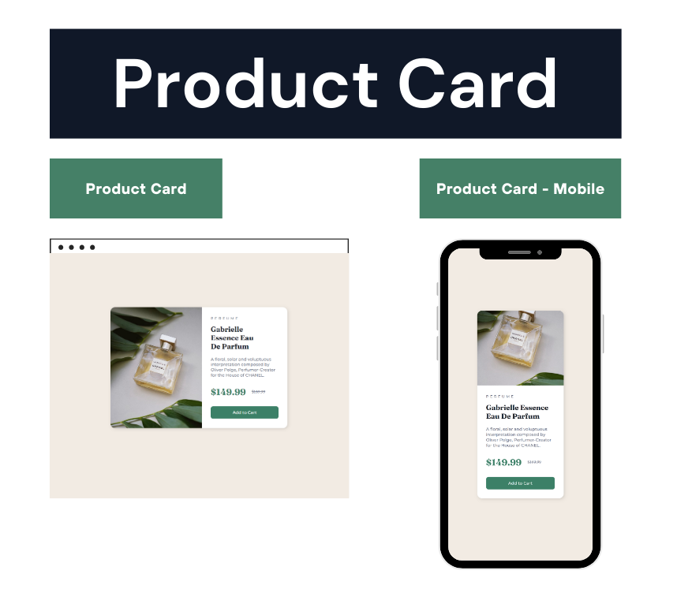

# Product Card Component - Challenge

O Product Card Component foi desenvolvido durante o desafio do Front-End Mentor.

O design do projeto foi disponibilizado através do Figma, e tive como desafio reproduzir o layout em código,
utilizando HTML e CSS.

## 🛠️ Tecnologias

- HTML
- CSS

## 💙 Contato

joaoliveira.batista1@gmail.com
